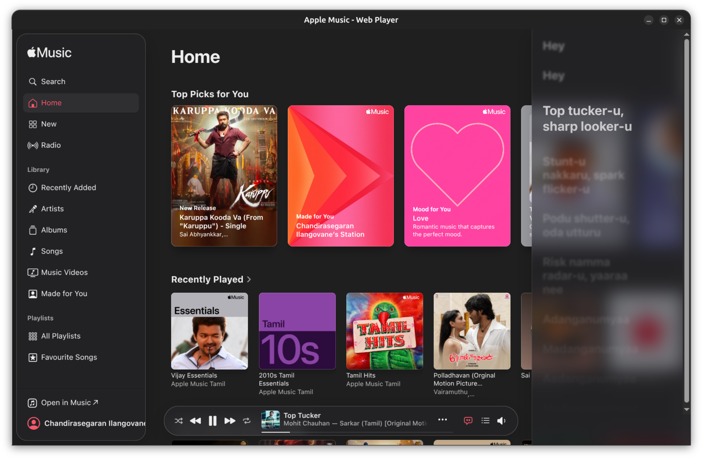
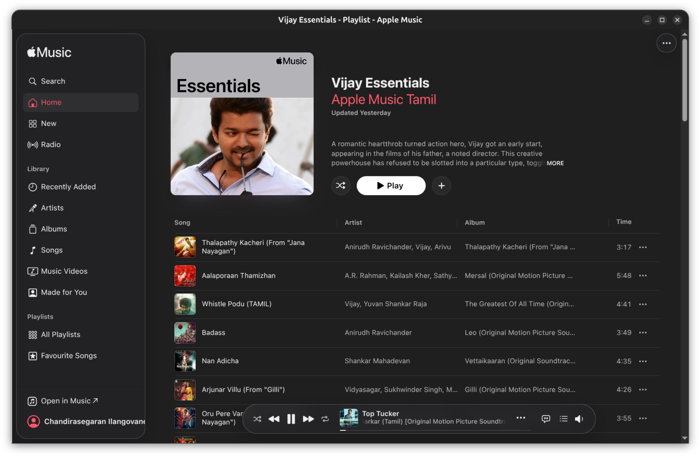

# Apple Music Linux Desktop App (Unofficial)

An unofficial Apple Music desktop app for Linux built with Electron.
This project wraps [music.apple.com](https://music.apple.com) in a native Linux window with persistent login sessions, desktop integration, and package builds for easy installation.

If you are searching for **Apple Music on Linux**, **Apple Music Linux app**, or **Apple Music desktop for Ubuntu/Fedora**, this project is made for that use case.

## Why this project?

Apple does not provide an official Apple Music desktop app for Linux.
This open source wrapper offers a smoother Linux experience than using the browser tab directly.

## Features

- Apple Music web player in a dedicated desktop window
- Persistent session storage (stay signed in across restarts)
- Single-instance behavior (prevents duplicate app windows)
- Linux-friendly app metadata, icon, and desktop entry support
- Offline fallback page when network loading fails
- Media control support (play/pause, next, previous)
- Package output for `.deb`, `.AppImage`, and `.tar.gz`

## Screenshots

### Home Screen



### Playlist View



## Tech Stack

- Electron
- TypeScript
- electron-builder

## Getting Started

### Prerequisites

- Node.js 18+ (or newer LTS recommended)
- npm
- Linux desktop environment (GNOME, KDE, etc.)

### Install dependencies

```bash
npm install
```

### Run in development

```bash
npm run start
```

## Build Linux packages

```bash
npm run dist
```

Build artifacts are generated in `release/`.

## DRM / Widevine note

Some Apple Music playback paths depend on Widevine-compatible Electron runtime behavior.
This repository also includes DRM-oriented build scripts:

```bash
npm run dist:drm
```

## Project Metadata

- App ID: `com.segar.applemusic`
- Product name: `Apple Music`
- License: `MIT`

## Contributing

Contributions are welcome.

1. Fork the repository
2. Create a feature branch
3. Commit your changes
4. Open a pull request

## Disclaimer

This is an independent, unofficial open source project and is not affiliated with, endorsed by, or sponsored by Apple Inc.
Apple Music and related marks are trademarks of Apple Inc.
